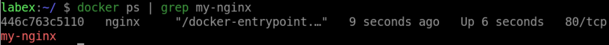

# Start a Container

## Introduction

In this step, you will learn how to start a container using the `docker run` command.

## Target

Start a new container from the `nginx` image.

## Result Example

Here is an example of what you should be able to accomplish at the end of this step:

1. Open a terminal or command prompt.

2. Run the `docker run` command to start a new container called `my-nginx`

## Requirements

- Docker must be installed on your machine.
