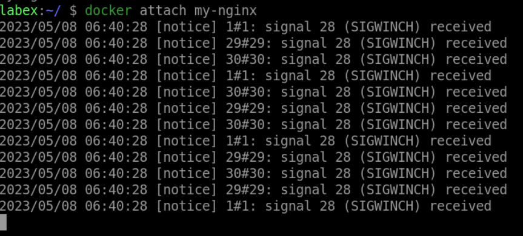

# Attach to a Running Container

## Introduction

In this step, you will learn how to attach to a running container using the `docker attach` command.

## Target

Attach to the `my-nginx` container.

## Result Example

Here is an example of what you should be able to accomplish at the end of this step:

1. Open a terminal or command prompt.

2. Run the `docker attach` command to connect to the `my-nginx` container.

## Requirements

- Docker must be installed on your machine.

- The container must be running.
