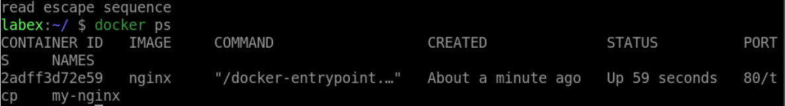

# Detach from a Running Container

## Introduction

In this step, you will learn how to detach from a running container without stopping it.

## Target

Detach from the `my-nginx` container.

## Result Example

Here is an example of what you should be able to accomplish at the end of this step:

Detach from the `my-nginx` container.

```bash
Press Ctrl-p Ctrl-q to detach from the container.
```



## Requirements

- Docker must be installed on your machine.

- The container must be running.
