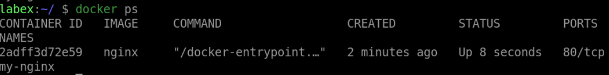
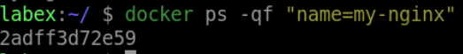
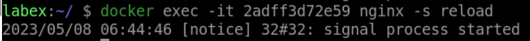

# Attach to a Specific Process

## Introduction

In this step, you will learn how to attach to a specific process inside a container.

## Target

Attach to the `nginx` process inside the `my-nginx` container.

## Result Example

Here is an example of what you should be able to accomplish at the end of this step:

1. Open a terminal or command prompt.

2. Restart the `my-nginx` container.

3. Run the `docker ps` command to get the `my-nginx` container ID.

4. Run the `docker exec` command to attach to the `nginx` process inside the container.

## Requirements

- Docker must be installed on your machine.

- The container must be running.
