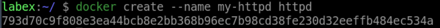

# Name the Container

## Introduction

In this sub-challenge, you will learn how to name a container using the `--name` option.

## Target

- Create a new container called `my-nginx` from the `nginx` image.

## Example

Here is an example of what you should be able to accomplish at the end of this step:

1. Open a terminal or command prompt.
2. Create a new container called `my-httpd` from the `httpd` image.

3. Check if the container has been created.

## Tip

If the container name is already in use, you can use the `docker rm -f xxx(container-name)` command to remove it.

## Requirements

- Docker must be installed on your machine.
