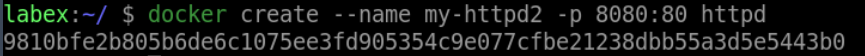
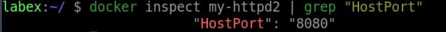

# Map Ports

## Introduction

In this sub-challenge, you will learn how to map ports using the `-p` option.

## Target

- Map port `8080` on the host to port `80` in a container called `my-nginx2`.

## Example

Here is an example of what you should be able to accomplish at the end of this step:

1. Open a terminal or command prompt.
2. Create a new container called `my-httpd2` from the `httpd` image and map port `8080` on the host to port `80` in the container.

3. Check if the host port mapping is in the container configuration.

## Tip

If the container name is already in use, you can use the `docker rm -f xxx(container-name)` command to remove it.

## Requirements

- Docker must be installed on your machine.
