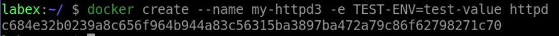
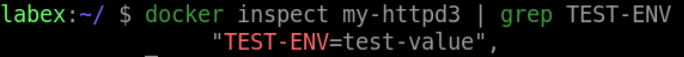

# Set Environment Variables

## Introduction

In this sub-challenge, you will learn how to set environment variables using the `-e` option.

## Target

- Set the `NGINX_HOST` environment variable to `example.com` in a container called `my-nginx3`.

## Example

Here is an example of what you should be able to accomplish at the end of this step:

- Open a terminal or command prompt.
- Create a new container called `my-httpd3` from the `httpd` image and set the `TEST-ENV` environment variable to `test-value` in the container.

- Check if the environment variable is in the container configuration.

## Tip

If the container name is already in use, you can use the `docker rm -f xxx(container-name)` command to remove it.

## Requirements

- Docker must be installed on your machine.
