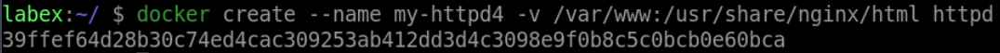
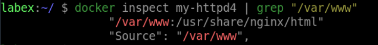

# Mount Volumes

## Introduction

In this sub-challenge, you will learn how to mount volumes using the `-v` option.

## Target

- Mount the `/var/www` directory on the host to the `/usr/share/nginx/html` directory in a container called `my-nginx4`.

## Example

Here is an example of what you should be able to accomplish at the end of this step:

1. Open a terminal or command prompt.
2. Create a new container called `my-httpd4` from the `httpd` image and mount the `/var/www` directory on the host to the `/usr/share/nginx/html` directory in the container.

3. Check if the volume mount of the container is configured in the container.

## Tip

If the container name is already in use, you can use the `docker rm -f xxx(container-name)` command to remove it.

## Requirements

- Docker must be installed on your machine.
