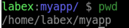
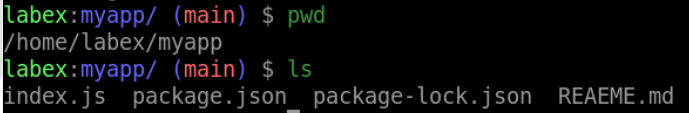

# Create a Dockerfile with Multi-stage Build

## Introduction

In this section, you will create a `Dockfile` file that uses a multi-stage build.

## Target

You goal is create a new `Dockerfile` using two stages. The first stage builds the application by installing the required dependencies and running the build script, and the second stage creates the final image by copying the compiled code from the first stage, installing only the production dependencies, and exposing the necessary port.

## Result Example

Here is an example of what you should be able to accomplish at the end of this step:

1. Create a new directory called `myapp` and navigate into it.



2. Download NodeJS source code from `https://github.com/joker-bai/nodejs-example.git`.



3. Create a new file called `Dockerfile` in the `myapp` directory with the following content:

```Dockerfile
# Stage 1: Build the application
FROM node:14-alpine AS base
WORKDIR /app
COPY . ./
RUN npm install

# Stage 2: Create the final image
FROM node:14-alpine
WORKDIR /app
COPY --from=base /app/ .
EXPOSE 3000
CMD [ "npm", "start" ]
```

## Requirements

To complete this challenge, you will need:

- Docker installed on your machine
