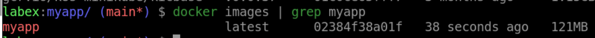

# Build a Docker Image

## Introduction

In this lab you will create an image using the `Dockerfile`.

## Target

Your goal is to create a new image called `myapp`.

## Result Example

Here is an example of what you should be able to accomplish at the end of this step:

1. Use `docker build` command to build a new image called `myapp`.

2. Verify that the image you built successfully.

## Requirements

To complete this challenge, you will need:

- Docker installed on your machine
