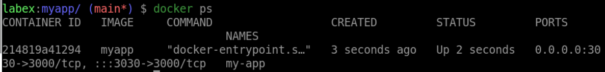
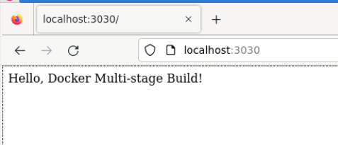

# Run a Docker Container

## Introduction

In this lab, We will use the Docker image to run a Container.

## Target

Your goal is to use the `myapp` image to run a container. The container should run on port `3000`, and then access it.

## Result Example

Here is an example of what you should be able to accomplish at the end of this step:

1. start a new Docker container called `my-app`.

2. Open a web browser and navigate to `http://localhost:3030` to access the running application.

## Requirements

To complete this challenge, you will need:

- Docker installed on your machine
