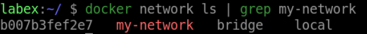

# Create a Network

## Introduction

In this step, we will create a simple network. We will create a network using the `docker network create` command.

## Target

Create a new network named `my-network`.

## Result Example

Here is an example of what you should be able to accomplish at the end of this step:

1. Let's create a bridge network named `my-network`.

2. Verify that the network was created by running.

## Requirements

- Docker must be installed on your machine.
