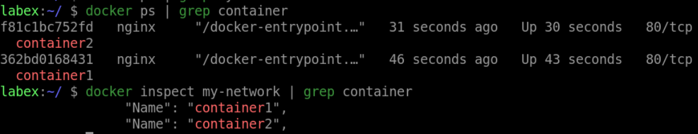

# Launch Containers in the Network

## Introduction

In this lab, we will use the network we created to start the container.

## Target

Start both containers named `container1` and `container2` using the `my-network` network.

## Result Example

Here is an example of what you should be able to accomplish at the end of this step:

Let's launch two containers and connect them to our `my-network` network.

## Requirements

- Docker must be installed on your machine.
- A network you has creaated.
