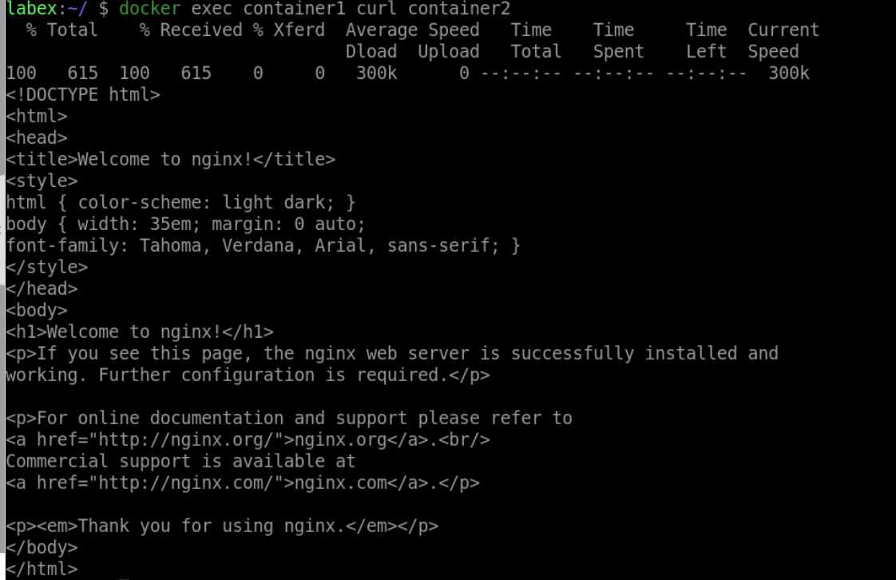

# Test Connectivity

## Introduction

In this step, we will test connectivity between the containers.

## Target

Your goal is to get into the `container1` container and use the `curl` command to access the `container2` container to make sure you can communicate properly.

## Result Example

Here is an example of what you should be able to accomplish at the end of this step:

Let's execute a command in `container1` that will access `container2`.

## Requirements

- Docker must be installed on your machine.
