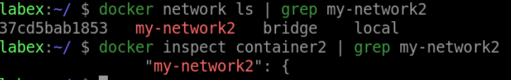
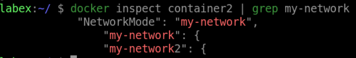

# Connect a Container to Multiple Networks

## Introduction

In this lab, we will learn that a container can be connected to more than one network.

## Target

Your goal is to create a new network called `my-network2` and connect it to the `container2` container.

## Result Example

Here is an example of what you should be able to accomplish at the end of this step:

1. Let's create another network named `my-network2` and connect `container2` to both networks.

2. Verify that `container2` is now connected to both networks by running

## Requirements

- Docker must be installed on your machine.
