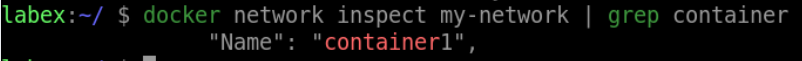

# Disconnect a Container From a Network

## Introduction

In this lab, We will learn how to disconnect a container from a network using the `docker network disconnect` command.

## Target

Your goal is to disconnect the `my-network` from the `container2` container.

## Result Example

Here is an example of what you should be able to accomplish at the end of this step:

1. Let's disconnect `container2` from `my-network`.

2. Verify that `container2` is no longer connected to `my-network` by running.

## Requirements

- Docker must be installed on your machine.
