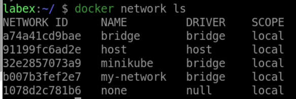

# Remove a Network

## Introduction

In this lab, we will learn how to remove a network using the `docker network rm` command.

## Target

Your goal is to remove the `my-network2` network.

## Result Example

Here is an example of what you should be able to accomplish at the end of this step:

1. Let's disconnect `container2` from `my-network2` and remove the `my-network2` network.

2. Verify that `my-network2` was removed by running.

## Requirements

- Docker must be installed on your machine.
