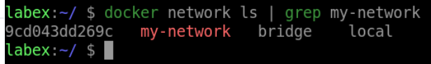
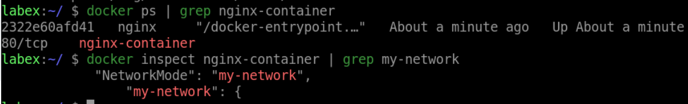
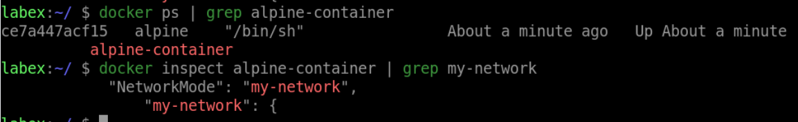
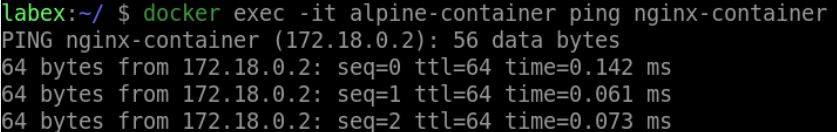

# Create a simple Docker network

## Introduction

In this step, you will create a simple Docker network with two containers connected to it. You will learn how to create a Docker network and how to connect containers to that network.

## Target

Create a Docker network named `my-network` and run two containers named `nginx-container` and `alpine-container` connected to that network.

## Result Example

Here is an example of what you should be able to accomplish at the end of this challenge:

1. Create a Docker network named `my-network`.

2. Run an Nginx container named `nginx-container` connected to `my-network`.

3. Run an Alpine container named `alpine-container` connected to `my-network`.

4. Verify that the containers can communicate with each other by pinging one from the other.

