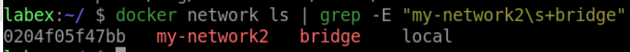
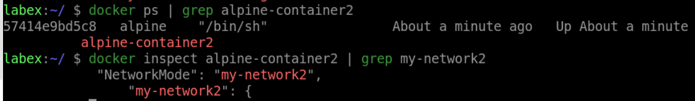
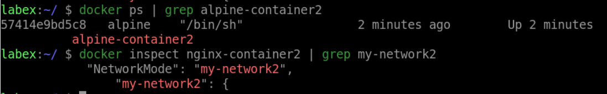
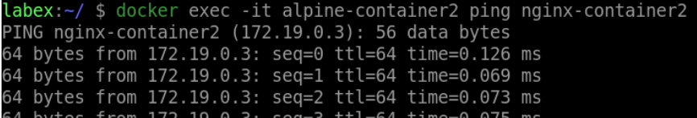

# Use a Docker network driver

## Introduction

In this step, you will learn how to use a Docker network driver. You will use a driver to create a network for your containers.

## Target

Use a Docker network driver to create a network for your containers.

## Result Example

Here is an example of what you should be able to accomplish at the end of this challenge:

1. Use the bridge driver to create a network named `my-network2`.

2. Run a container named `alpine-container2` connected to `my-network2`.

3. Run a container named `nginx-container2` connected to `my-network2`.

4. Verify that the container can communicate with another container on the same network.

