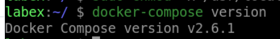
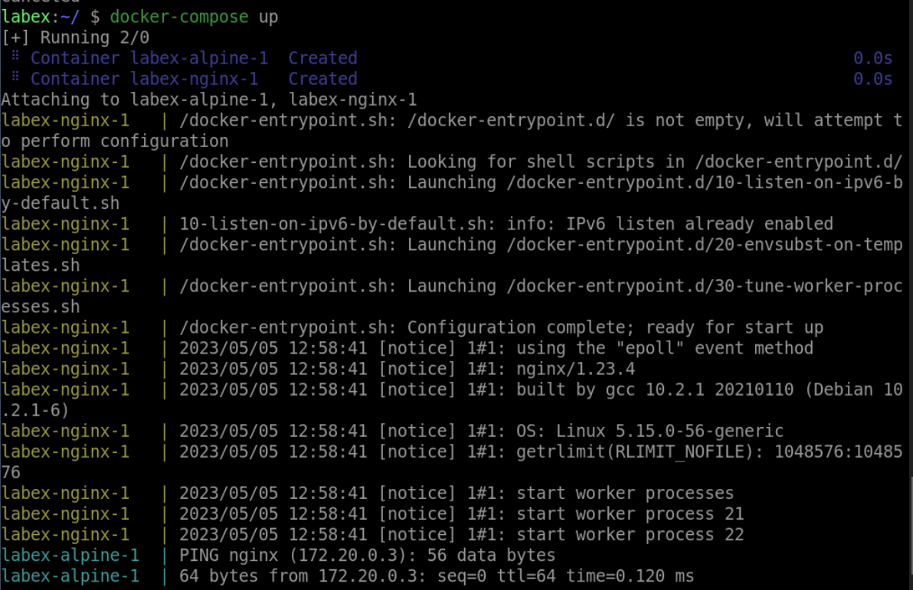

# Use Docker networks with Compose

## Introduction

In this step, you will learn how to use Docker networks with Compose. You will create a simple Compose file that includes a network configuration.

## Target

Create a Compose file that includes a network configuration and run the containers using `docker-compose up`.

## Result Example

Here is an example of what you should be able to accomplish at the end of this challenge:

1. Create a Compose file that includes a network configuration.

2. Download `docker-compose`.

3. Run the containers using `docker-compose up`.

4. Verify that the containers can communicate with each other by pinging one from the other.

