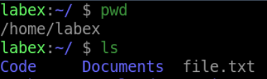

# Copying a File from Host to Container

## Introduction

The `docker cp` command can be used to copy a file from your local machine to a running Docker container. This is useful when you want to add a file to a container or update an existing file inside a container.

## Target

In this step, your goal is to copy a file named `file.txt` from your local machine to a running Docker container named `my_container`.

## Result Example

Here is an example of what you should be able to accomplish at the end of this step:

1. Start a container named `my_container`.

2. Create a file named `file.txt` on your local machine with some content

3. Copy the `file.txt` file to the `my_container` container.

## Requirements

- Docker installed on your local machine.

- A running Docker container.
