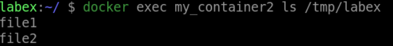
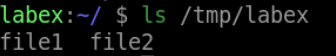

# Copying a Directory from Container to Host

## Introduction

The `docker cp` command can also be used to copy directories between your local machine and a running Docker container. This is useful when you need to transfer multiple files or a whole directory to/from a container.

## Target

In this step, your goal is to copy a directory named `labex` from a running Docker container named `my_container2` to your local machine.

## Result Example

Here is an example of what you should be able to accomplish at the end of this step:

1. Start a container named `my_container2`.

2. Inside the container, create a directory named `labex` in the `/tmp` directory with some files

3. Copy the `labex` from the running container to your local machine

## Requirements

- Docker installed on your local machine.

- A running Docker container with a directory named `labex`.
