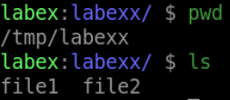
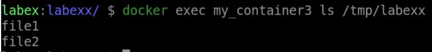

# Copying a Directory from Host to Container

## Introduction

The `docker cp` command can also be used to copy directories from your local machine to a running Docker container. This is useful when you need to add a directory to a container or update an existing directory inside a container.

## Target

In this step, your goal is to copy a directory named `labexx` from your local machine to a running Docker container named `my_container3`.

## Result Example

Here is an example of what you should be able to accomplish at the end of this step:

1. Start a container named `my_container3`.

2. Create a directory named `labexx` on your local machine in the `/tmp` directory and populate it with some files

3. Copy the `labexx` from your local machine to the running container

## Requirements

- Docker installed on your local machine.

- A running Docker container.

- A directory named `labexx` on your local machine.
