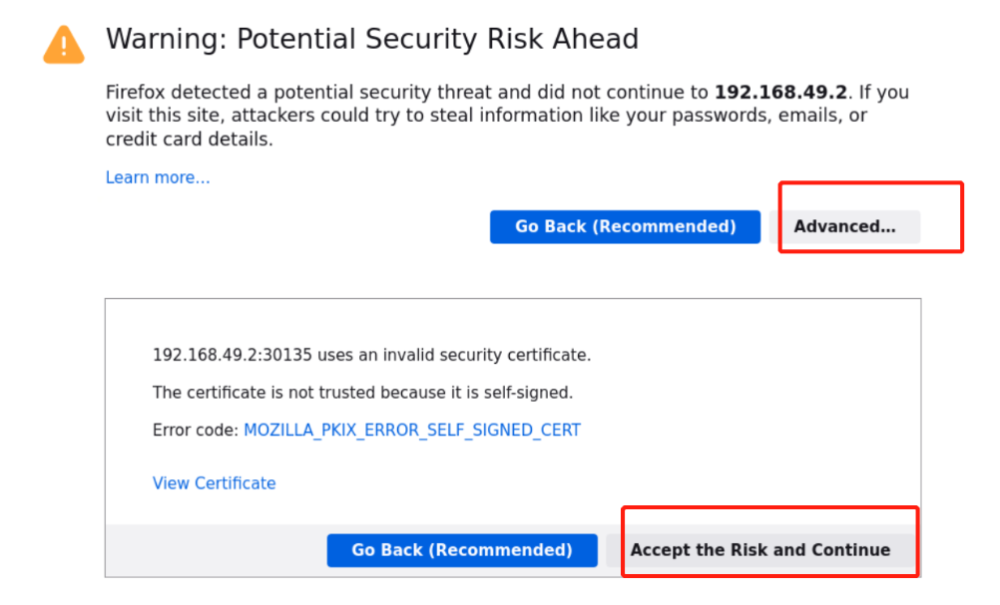
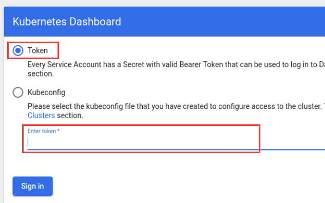
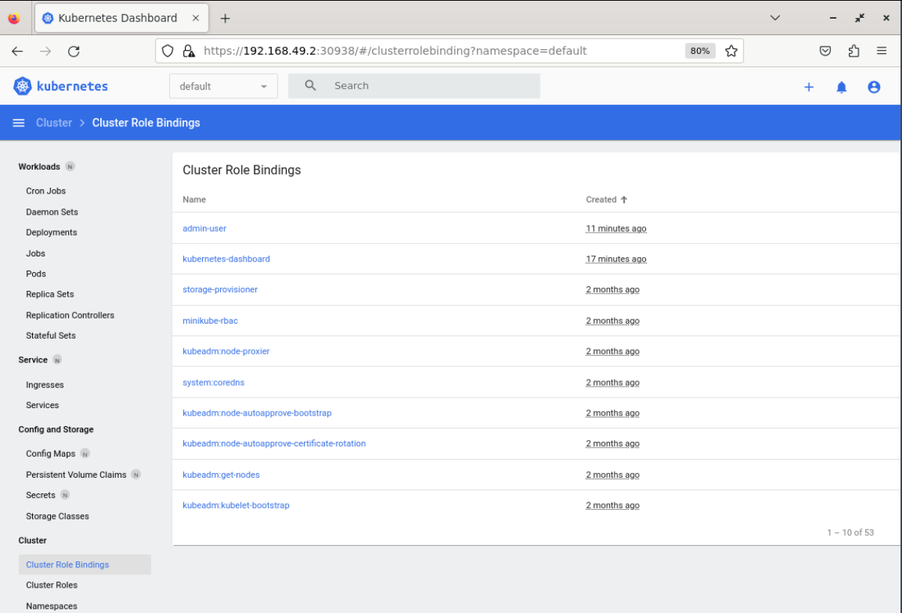

# Accessing Kubernetes Dashboard

In this step, we will access the Kubernetes Dashboard using a web browser.

1. Now we need to find the token we can use to log in. Execute the following command:

   ```bash
   kubectl -n kubernetes-dashboard create token admin-user
   ```

   This will output a token that you can use to log in to the Kubernetes Dashboard.

2. Use the following command to change the service type of the kubernetes dashboard to `NodePort` in line 33.

   ```bash
   kubectl edit service -n kubernetes-dashboard kubernetes-dashboard
   ```

   Then use the following command to get the nodeport of the kubernetes dashboard.

   ```bash
   kubectl get service -n kubernetes-dashboard
   ```

3. Use the following command to get the kubernetes node ip address.

   ```bash
   kubectl get node -o wide
   ```

   The data labeled as `INTERNAL-IP` is the IP address of the node.

4. Open a web browser and navigate to `https://<node-ip>:<node-port>`.

   Replace `<node-ip>` with the node IP address and replace `<node-port>` with the kubernetes dashboard node port.

5. Since there is no legal TLS certificate, we need to select `Advanced` and choose `Accept the Risk and Continue` after the warning message pops up in the browser.



6. Select the `Token` option, and enter the access token from step 1 when prompted.



7. You should now be logged in to the Kubernetes Dashboard, and can explore the various features and resources available.


