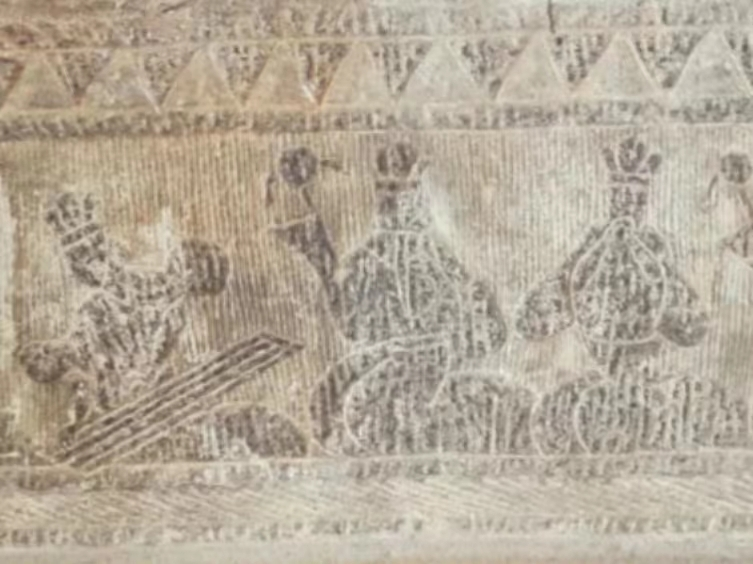
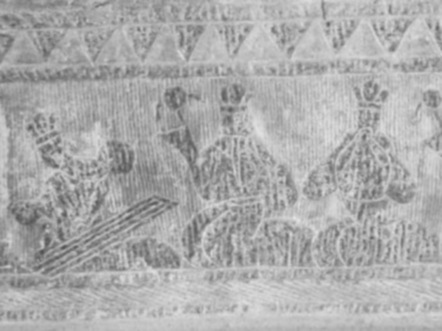

# Reading and Preprocessing the Image

The first step in any image processing task is to read the image and prepare it for further processing. In this sub-challenge, you will learn how to read an image, convert it to grayscale, and apply Gaussian Blur to reduce noise.

## TODO

Please complete the `read_and_preprocess_image` function in the file `/home/labex/project/read_and_preprocess_image.py`.

1. Read an image file using the OpenCV `cv2.imread()` function.
2. Convert the color image to a grayscale image using the OpenCV `cv2.cvtColor()` function.
3. Apply Gaussian Blur to the grayscale image using the OpenCV `cv2.GaussianBlur()` function, with a default kernel size of 5x5.

## example

The original image before processing looks like this:



```python
image, blurred_image = read_and_preprocess_image("image_test.jpg")
```

The image processing result (blurred_image) is as follows:


