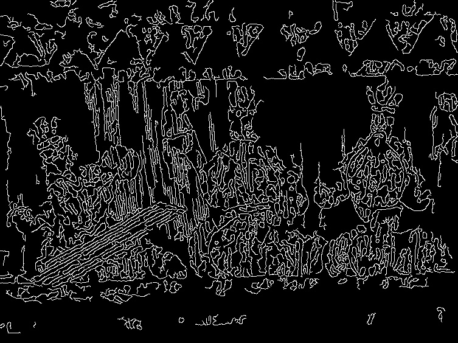

# Applying Edge Detection Algorithms

In this sub-challenge, you will explore two popular edge detection algorithms: the Canny edge detection and the Laplacian of Gaussian (LoG) method. You will apply both methods to the preprocessed image and compare their results.

## TODO

Please complete the `apply_edge_detection` function in the file `/home/labex/project/apply_edge_detection.py`.

1. Implement the Canny edge detection algorithm using the OpenCV `cv2.Canny()` function, with appropriate threshold values.
2. Implement the Laplacian of Gaussian (LoG) method by first applying the Laplacian operator using the OpenCV `cv2.Laplacian()` function, and then thresholding the result using the OpenCV `cv2.threshold()` function.
3. return the Canny edge detection result, and the LoG result for comparison.

## example

Take an example to process the target image.

```python
image, blurred_image = read_and_preprocess_image("image_test.jpg")
canny_edges_img, log_edges_img = apply_edge_detection(blurred_image)
```

In Canny edge detection, the low thresholds is 20, and the high thresholds is 120

The image processing results are as follows:



n Laplacian of Gaussian (LoG) edge detection, the image is first Laplacian filtered with the parameter ddepth as `cv2.CV_64F`.
The image is then binarized based on the results of Laplace filtering. The binarization threshold range set here is 3 and 250, and binary thresholding is used. The obtained image is displayed as follows:


