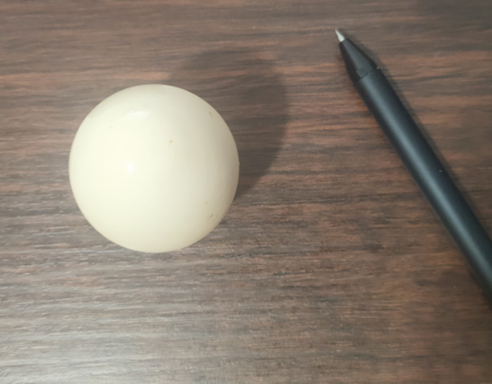

# read_and_preprocess_image

In this sub-challenge, you will import the necessary libraries, and read the input image. You will also apply some preprocessing steps to the image to prepare it for further processing.

## TODO:

Please complete the read_and_preprocess_image function in the file `/home/labex/project/read_and_preprocess_image.py`.

- Import the necessary libraries.
- Read the input image using OpenCV.
- Convert the image to grayscale.
- Apply Gaussian blur to the image. (You can choose the appropriate parameters yourself.)
- return the blurred_image.

## example

The original image before processing looks like this:



```python
blurred_image = read_and_preprocess_image("image.jpg")
```

The image processing result (blurred_image) is as follows:


