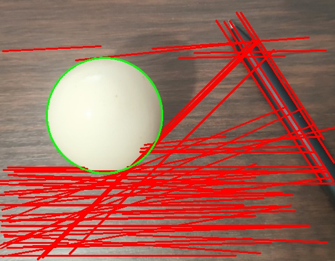
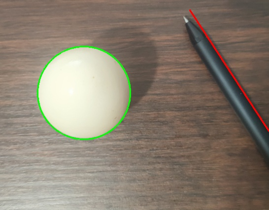

# Combined Detection and Optimization

In this sub-challenge, you will combine the line and circle detection results, and learn about a method to optimize false detection.

## TODO:

Please complete the draw_lines_and_circles function in the file `/home/labex/project/draw_lines_and_circles.py`.

- Combine the line and circle detection results on a single image
- Return the final image with both lines and circles accurately detected

In addition, you can try to filter out false detections as much as possible. This will not be specifically required in the challenge. We only provide a possible idea in the example.

## example

When lines detection is performed using the following parameters:

```python
rho = 1
theta = np.pi / 180
threshold = 100
min_line_length = 100
max_line_gap = 50
binary = cv2.Canny(image, 20, 40)
```

When circles detection is performed using the following parameters:

```python
dp = 1
min_dist = 50
param1 = 100
param2 = 30
min_radius = 10
max_radius = 100
```

The results are displayed as follows:

A circle and many lines are detected. It is obvious that there are some false detections.



## filter out false detections

We only detect one circle. So we just need to adjust the parameters of the relevant function for detecting straight lines. Through continuous testing, here is a more suitable set of parameters that can be used for line detection:

```python
rho = 1
theta = np.pi / 180
threshold = 200
min_line_length = 200
max_line_gap = 50

binary = cv2.Canny(image, 20, 40)
```

The results are displayed as follows:



The false detections are successfully filtered out！
