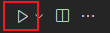
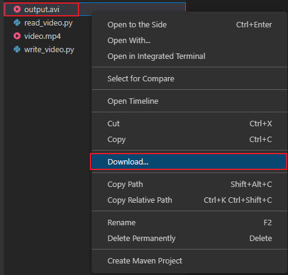

# Writing and Saving a Video

To write and save a video, you need to create a `VideoWriter` object. Here's an example of how to write and save a video:

Video path is `/home/labex/project/video.mp4`

File path is `/home/labex/project/write_video.py`

Open the `write_video.py` file. Then input the following code.

```python
import cv2

# Create a VideoCapture object
cap = cv2.VideoCapture('video.mp4')

# Get the video frame size and frame rate
width = int(cap.get(cv2.CAP_PROP_FRAME_WIDTH))
height = int(cap.get(cv2.CAP_PROP_FRAME_HEIGHT))
fps = int(cap.get(cv2.CAP_PROP_FPS))

# Create a VideoWriter object
fourcc = cv2.VideoWriter_fourcc(*'XVID')
out = cv2.VideoWriter('output.avi', fourcc, fps, (width, height))

while True:
    # Read a frame from the video
    ret, frame = cap.read()

    if ret:
        # Process the frame
        # ...

        # Write the processed frame to the output video
        out.write(frame)

    else:
        break

print('Video save successfully!')

# Release the VideoCapture and VideoWriter objects
cap.release()
out.release()
```

In this example, we create a `VideoCapture` object by passing the path of the video file to be read. Then, we get the video frame size and frame rate using the `get()` method. Next, we create a `VideoWriter` object by passing the output file name, fourcc code, frame rate, and frame size. The fourcc code is a four-byte code used to specify the video codec. In this example, we use the XVID codec.

We then use a `while` loop to read each frame of the video using the `read()` method. If the frame is successfully read, we process it (e.g., apply filters) and write it to the output video using the `write()` method of the `VideoWriter` object. Finally, we release the `VideoCapture` and `VideoWriter` objects.

You can run the following command in the terminal to execute.

```bash
python /home/labex/project/write_video.py
```

Or you can just click the button like this  in the top right corner to execute.

Afterward, wait for Terminal to output "Video save successfully!" and you will see an output video called `output.avi` in the project folder.However, the current environment does not support the viewing of video files. You will need to download the file locally, as shown below, and then view it using the video player.


